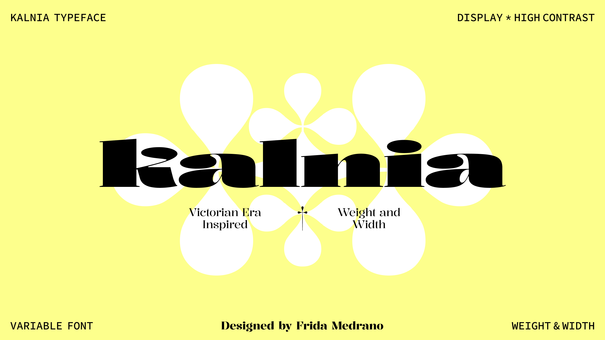
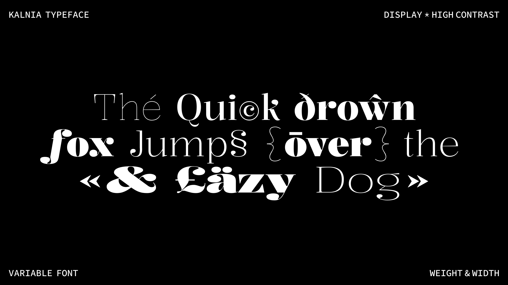

# Kalnia Typeface

<!-- [![][Fontbakery]](https://fridamedrano.github.io/Kalnia-Typeface/fontbakery/fontbakery-report.html)
[![][Universal]](https://fridamedrano.github.io/Kalnia-Typeface/fontbakery/fontbakery-report.html)
[![][GF Profile]](https://fridamedrano.github.io/Kalnia-Typeface/fontbakery/fontbakery-report.html)
[![][Outline Correctness]](https://fridamedrano.github.io/Kalnia-Typeface/fontbakery/fontbakery-report.html)
[![][Shaping]](https://fridamedrano.github.io/Kalnia-Typeface/fontbakery/fontbakery-report.html) -->

[Fontbakery]: https://img.shields.io/endpoint?url=https%3A%2F%2Fraw.githubusercontent.com%2Ffridamedrano%2FKalnia-Typeface%2Fgh-pages%2Fbadges%2Foverall.json
[GF Profile]: https://img.shields.io/endpoint?url=https%3A%2F%2Fraw.githubusercontent.com%2Ffridamedrano%2FKalnia-Typeface%2Fgh-pages%2Fbadges%2FGoogleFonts.json
[Outline Correctness]: https://img.shields.io/endpoint?url=https%3A%2F%2Fraw.githubusercontent.com%2Ffridamedrano%2FKalnia-Typeface%2Fgh-pages%2Fbadges%2FOutlineCorrectnessChecks.json
[Shaping]: https://img.shields.io/endpoint?url=https%3A%2F%2Fraw.githubusercontent.com%2Ffridamedrano%2FKalnia-Typeface%2Fgh-pages%2Fbadges%2FShapingChecks.json
[Universal]: https://img.shields.io/endpoint?url=https%3A%2F%2Fraw.githubusercontent.com%2Ffridamedrano%2FKalnia-Typeface%2Fgh-pages%2Fbadges%2FUniversal.json

## Overview

Kalnia is a variable font with weight and width axes designed with high contrast and refined terminals, drawing inspiration from the Victorian era. This historical period marked a transition from manual to machine production, and the 'fat face' style emerged—a bold and attention-grabbing typography used for poster headlines to stand out from traditional typefaces. 

Kalnia embodies the delicate and the boldness, bridging the gap between the old and the new. This display font family comprises a total of eight styles, making it a versatile choice for poster headlines and expressive design projects.

## About Frida Medrano

Frida Medrano is a Mexican type and interaction designer currently based in San Fransisco, California. She is interested in design automation and exploration projects where code and design converge. She won the SOTA Catalyst Award in 2018 and has presented her work in forums like ATypI, TypeLab, TypeCon, IxDA, Letrástica, and TMX.

[fridamedrano.com](http://www.fridamedrano.com) | [Instagram](https://www.instagram.com/fridaemg) | [GitHub](https://github.com/fridamedrano) | [Twitter](https://twitter.com/fridaemg)

## Building

Fonts are built automatically by GitHub Actions - take a look in the "Actions" tab for the latest build.

If you want to build fonts manually on your own computer:

* `make build` will produce font files.
* `make test` will run [FontBakery](https://github.com/googlefonts/fontbakery)'s quality assurance tests.
* `make proof` will generate HTML proof files.

The proof files and QA tests are also available automatically via GitHub Actions.

## Changelog

15 October 2022. Version 1.00

## License

This Font Software is licensed under the SIL Open Font License, Version 1.1.
This license is available with a FAQ at
https://scripts.sil.org/OFL

## Repository Layout

This font repository structure is inspired by [Unified Font Repository v0.3](https://github.com/unified-font-repository/Unified-Font-Repository), modified for the Google Fonts workflow.
