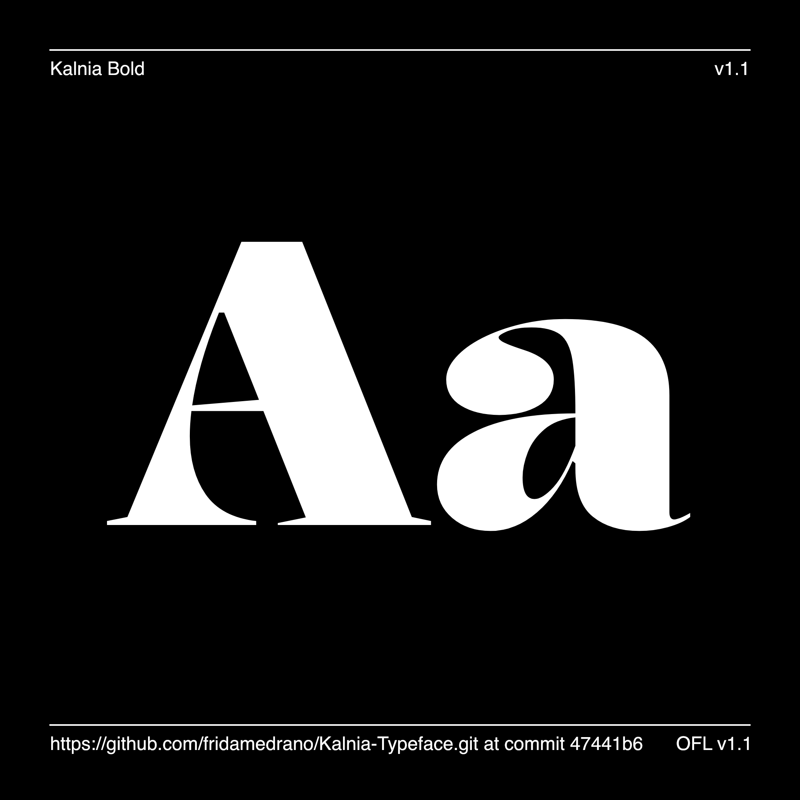

# Kalnia Typeface

[![][Fontbakery]](https://fridamedrano.github.io/Kalnia-Typeface/fontbakery/fontbakery-report.html)
[![][Universal]](https://fridamedrano.github.io/Kalnia-Typeface/fontbakery/fontbakery-report.html)
[![][GF Profile]](https://fridamedrano.github.io/Kalnia-Typeface/fontbakery/fontbakery-report.html)
[![][Outline Correctness]](https://fridamedrano.github.io/Kalnia-Typeface/fontbakery/fontbakery-report.html)
[![][Shaping]](https://fridamedrano.github.io/Kalnia-Typeface/fontbakery/fontbakery-report.html)

[Fontbakery]: https://img.shields.io/endpoint?url=https%3A%2F%2Fraw.githubusercontent.com%2Ffridamedrano%2FKalnia-Typeface%2Fgh-pages%2Fbadges%2Foverall.json
[GF Profile]: https://img.shields.io/endpoint?url=https%3A%2F%2Fraw.githubusercontent.com%2Ffridamedrano%2FKalnia-Typeface%2Fgh-pages%2Fbadges%2FGoogleFonts.json
[Outline Correctness]: https://img.shields.io/endpoint?url=https%3A%2F%2Fraw.githubusercontent.com%2Ffridamedrano%2FKalnia-Typeface%2Fgh-pages%2Fbadges%2FOutlineCorrectnessChecks.json
[Shaping]: https://img.shields.io/endpoint?url=https%3A%2F%2Fraw.githubusercontent.com%2Ffridamedrano%2FKalnia-Typeface%2Fgh-pages%2Fbadges%2FShapingChecks.json
[Universal]: https://img.shields.io/endpoint?url=https%3A%2F%2Fraw.githubusercontent.com%2Ffridamedrano%2FKalnia-Typeface%2Fgh-pages%2Fbadges%2FUniversal.json

Kalnia is a display typeface with high contrast and delicate terminals for poster headlines. During the Victorian era, machines made mass production possible, changing design forever. Classical text typefaces didn’t satisfy the necessities of the time, and typography with bold and impactful letters appeared. Kalnia was born by this concept, inspired by the ‘fat faces’ of that time. 
Kalnia is a family with a total of eight styles. It includes four weights: Thin, Light, Regular, and Bold. Each one also has its normal and extended width adding: Thin Extended, Light Extended, Regular Extended, and Bold Extended.
The typeface also has a variable font with weight and width axes. 

## About Frida Medrano

Frida Medrano is a Mexican type and interaction designer currently based in San Fransisco, California. She is interested in design automation and exploration projects where code and design converge. 
She won the SOTA Catalyst Award in 2018 and has presented her work in forums like ATypI, TypeLab, TypeCon, IxDA, Letrástica, and TMX.

[fridamedrano.com](http://www.fridamedrano.com)
[Instagram](https://www.instagram.com/fridaemg) [GitHub](https://github.com/fridamedrano) [Twitter](https://twitter.com/fridaemg)

## Changelog

**4 April 2022. Version 1.00**

## License

This Font Software is licensed under the SIL Open Font License, Version 1.1.
This license is available with a FAQ at
https://scripts.sil.org/OFL

## Repository Layout

This font repository structure is inspired by [Unified Font Repository v0.3](https://github.com/unified-font-repository/Unified-Font-Repository), modified for the Google Fonts workflow.
